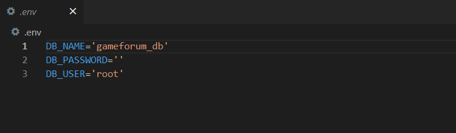
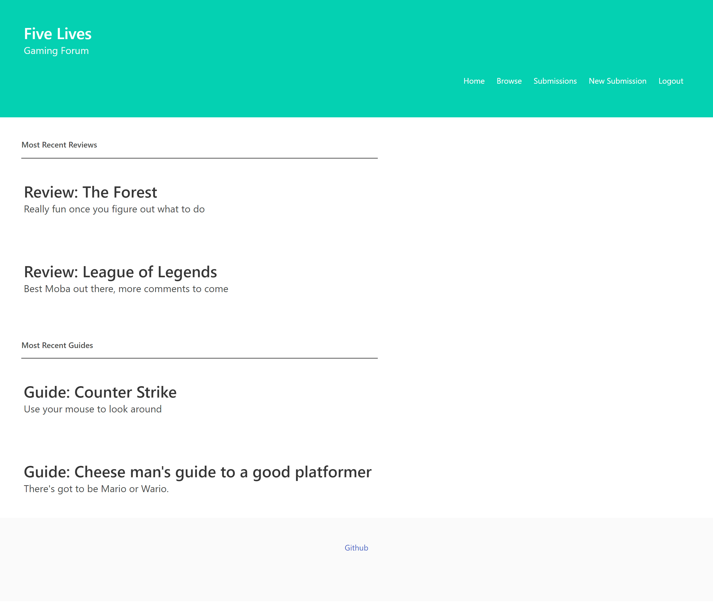

# Five Lives Game Forum 

## Description

We created a web application that functions as a video game forum. Users can post reviews, guides, and general posts about different video game subjects expecting comments from fellow users. 

## Installation

Input a .env file to the root:

## Usage 

This web application was created using JavaScript, mySQL, Handlebars.js, Heroku, and Bulma CSS framework.

#### The work done can be found on the GitHub repository [tannerkothlow/five-lives-game-forum](https://github.com/tannerkothlow/five-lives-game-forum)
- The actual product can be found **[here](https://hidden-fjord-30067.herokuapp.com/)** and should look along the lines of this depending on device screen size:

## Credits
- [Bulma CSS Framework](https://bulma.io/)
- [Handlebars.js](https://handlebarsjs.com/)
- [Heroku](https://www.heroku.com/platform)
- [mySQL2](https://www.mysql.com/)

## Features
- Bulma CSS Framework
- express
- Handlebars.js
- Heroku
- JavaScript
- mySQL2
- node

